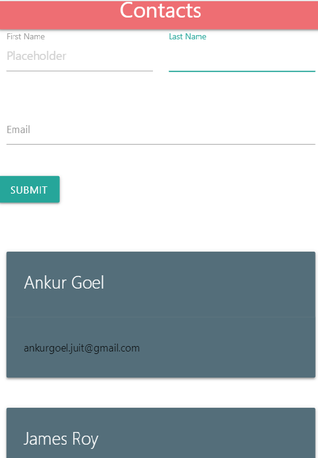

# Contacts Store

    - It is a very simple application for storing contacts.
    - The front end is built using react and integrates with a spring-boot backend using REST APIs
    
This project was bootstrapped with [Create React App](https://github.com/facebook/create-react-app) and [Spring Initializr](https://start.spring.io/).

### Demo


### Installation

Contacts Store requires:
    - [Node.js](https://nodejs.org/)
    - JDK 8+, Maven
    
#### Backend
```java
Run the spring boot main class - ContactsApplication.java or
Start the app from Spring Boot Dashboard or
Press F5 in vscode.
```
#### Frontend
Install the dependencies and start the server.

```sh
cd client
npm install
npm start
```
Open [http://localhost:3000](http://localhost:3000) to view it in the browser. You will also see any lint errors in the console.
